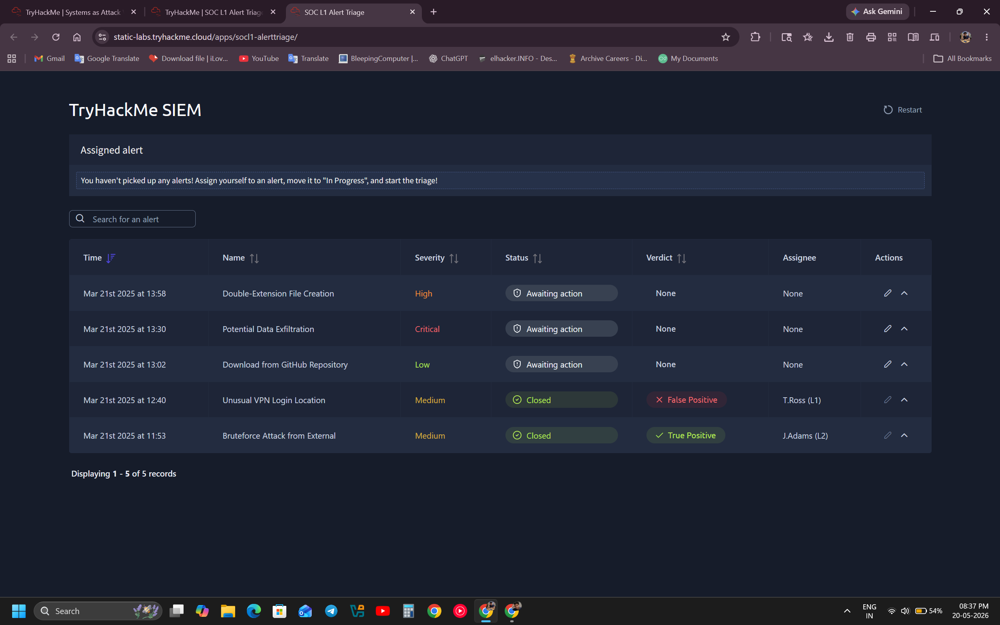
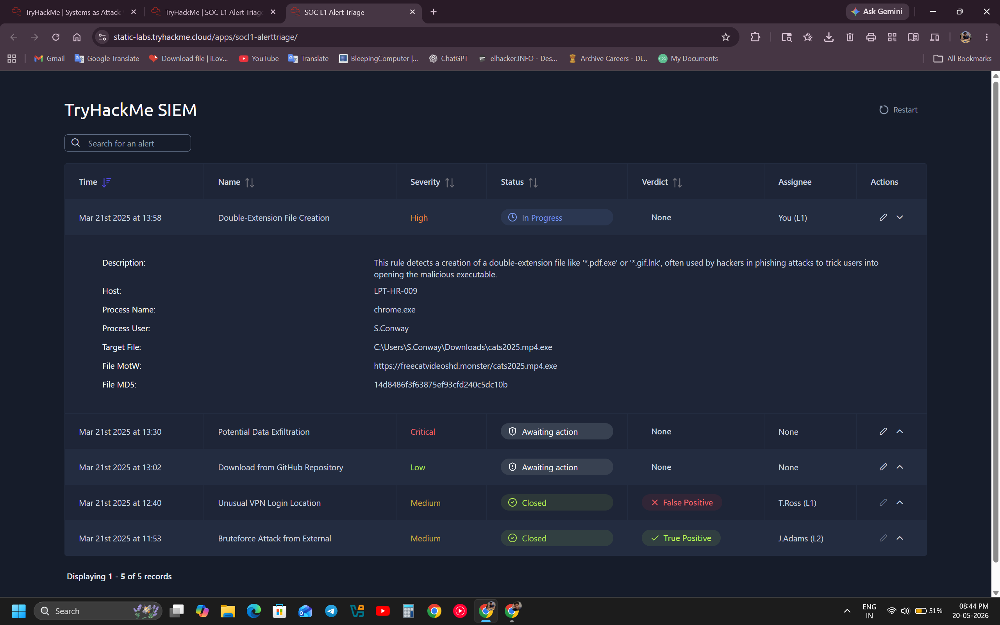
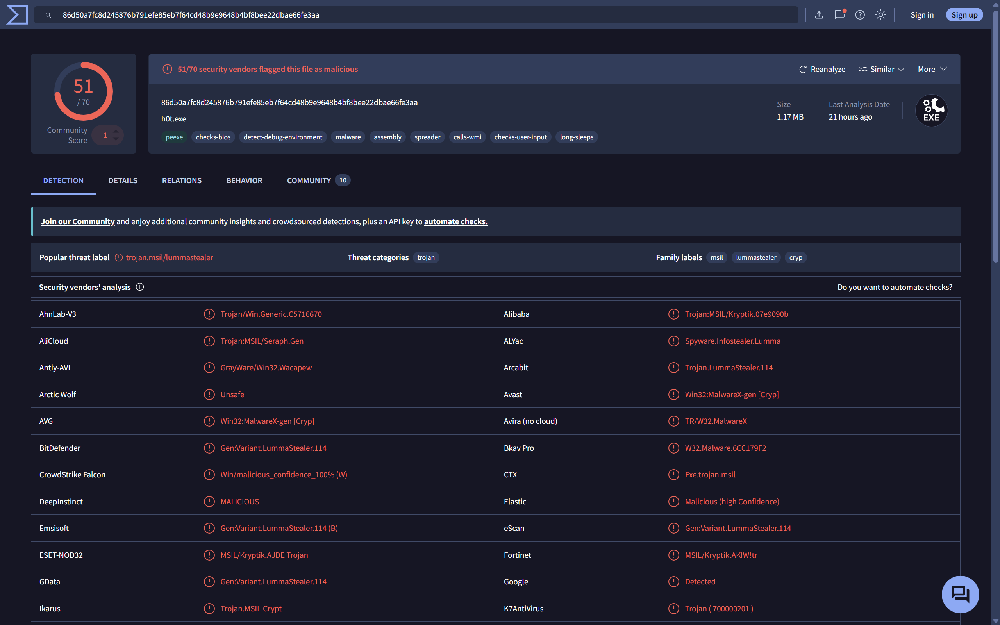
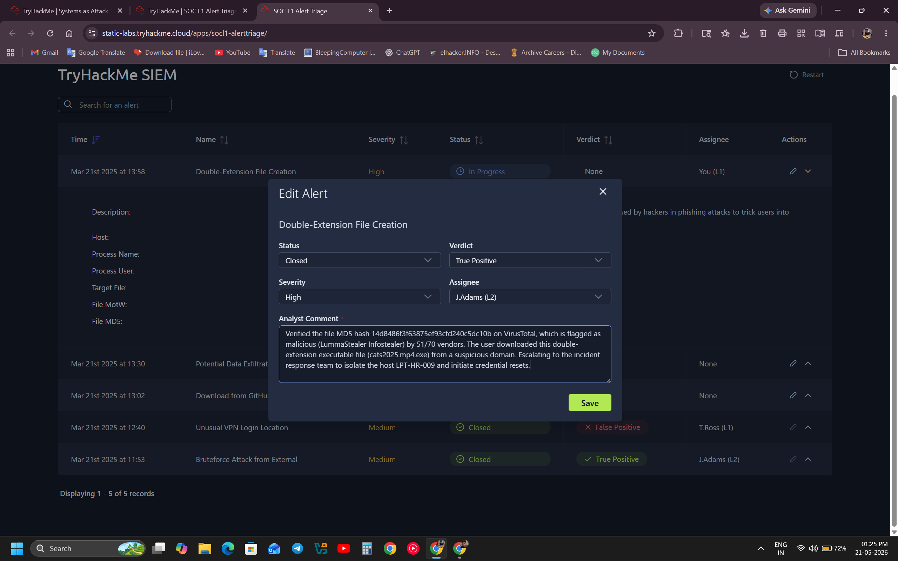
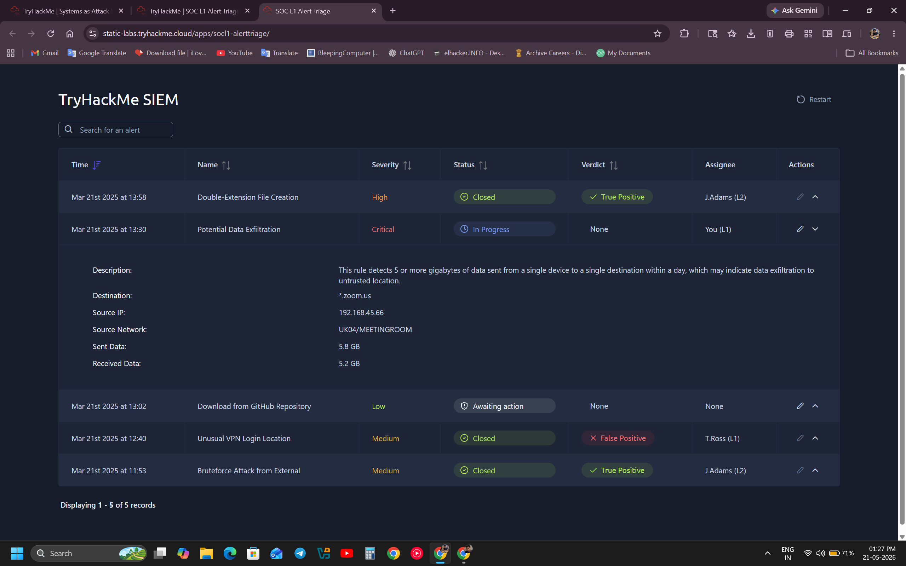
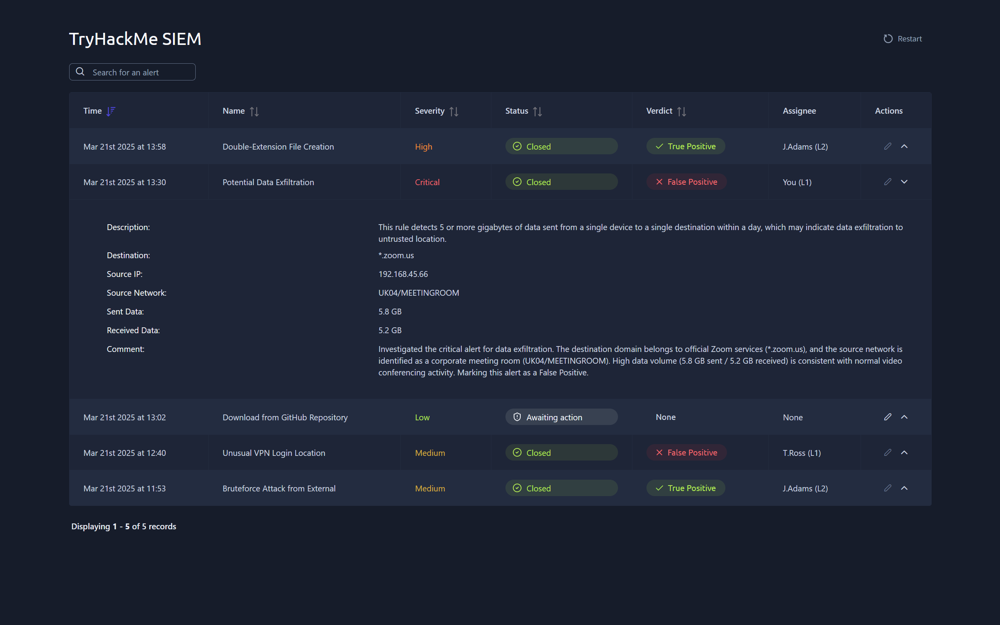
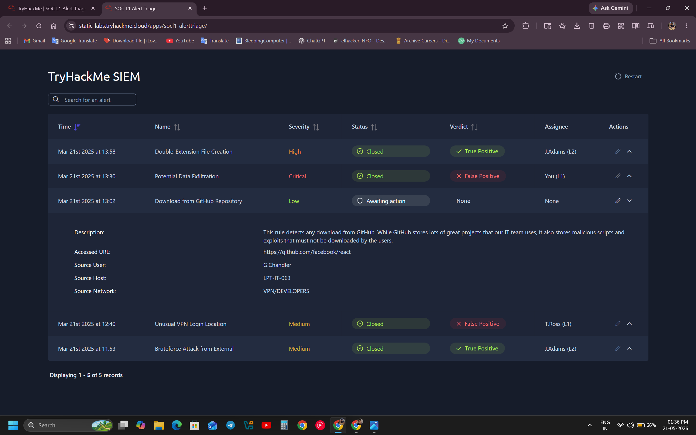
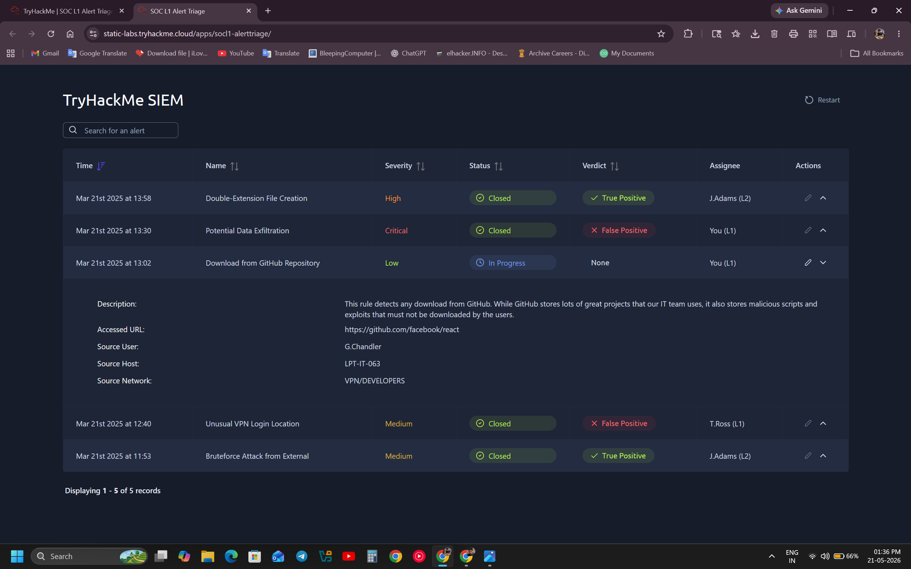
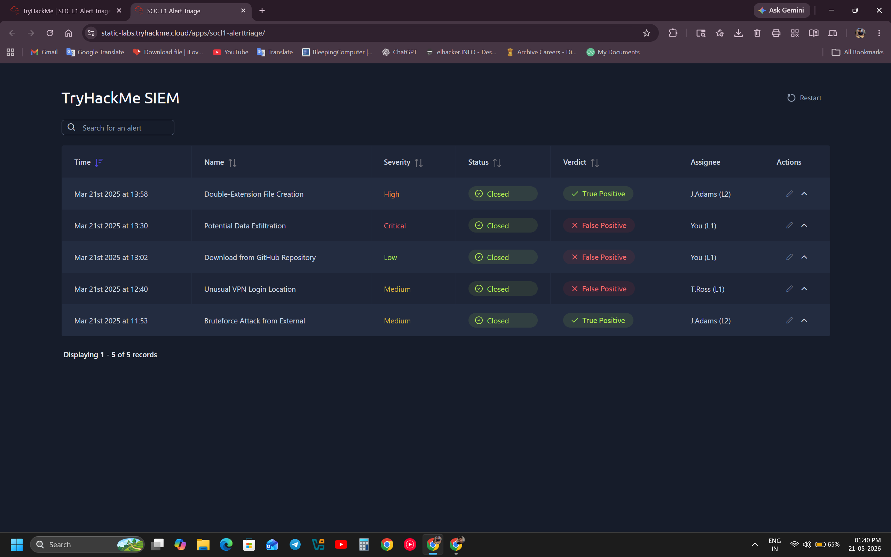

# SIEM Alert Triage Log Analysis (TryHackMe) 🛡️

## 📌 Project Overview
This project demonstrates my ability to function as a SOC Analyst (Level 1) by monitoring, investigating, and triaging security alerts triggered within a SIEM platform. Using a hacker mindset combined with defensive methodologies, I analyzed host log events and network patterns to determine whether alerts were **True Positives (TP)** or **False Positives (FP)**.

### 📊 SIEM Alert Dashboard Overview

---

## 🛠️ Environment & Tools Used
* **SIEM Platform:** TryHackMe Custom SIEM Dashboard
* **Threat Intelligence:** VirusTotal
* **Concepts:** Endpoint Security, Host Log Analysis, Traffic Data Exfiltration, Corporate Security Policy

---

## 🔍 Case Studies Investigated

### 🔴 Case 1: Double-Extension File Creation (Malware Delivery)
* **Severity:** High
* **Host System:** `LPT-HR-009` (HR Department) | **User:** `S.Conway`
* **Trigger Event:** User downloaded a file named `cats2025.mp4.exe` from an external domain (`https://freecatvideoshd.monster`).

#### 🕵️‍♂️ Investigation & Analysis:

* Extracted the unique MD5 file hash: `14d8486f3f63875ef93cfd240c5dc10b`.
* Queried the hash on **VirusTotal**, resulting in a **51/70 malicious detection rate** flagging it as **LummaStealer (Infostealer)** malware.

* **Verdict:** ✅ **True Positive**
* **Action Taken:** Escalated the ticket to L2 / Incident Response team to immediately isolate the host machine from the network and force global credential resets for the impacted user.

---

### 🔵 Case 2: Potential Data Exfiltration (Network Traffic Anomaly)
* **Severity:** Critical
* **Host/Network:** `UK04/MEETINGROOM` (IP: `192.168.45.66`)
* **Trigger Event:** Network rule triggered for high data volume transfer (>5 GB) sent out within a day. Logs showed **5.8 GB Sent** and **5.2 GB Received**.

#### 🕵️‍♂️ Investigation & Analysis:
* Analyzed the destination network domain name, which pointed strictly to official Zoom services (`*.zoom.us`).
* Cross-referenced the physical location (Corporate Meeting Room), confirming that high outbound/inbound data throughput is normal for premium high-definition video conferencing sessions.
* **Verdict:** ❌ **False Positive**
* **Action Taken:** Documented the baseline activity details and closed the alert safely without system disruption.

---

### 🔵 Case 3: Download from GitHub Repository (Policy Violation Check)
* **Severity:** Low
* **Host/Network:** `LPT-IT-063` (VPN/DEVELOPERS) | **User:** `G.Chandler`
* **Trigger Event:** Alert triggered based on a standard security policy monitoring any direct source code downloads from GitHub.

#### 🕵️‍♂️ Investigation & Analysis:
* Reviewed the exact accessed URL: `https://github.com/facebook/react`.
* Identified the user as an authorized software engineer working inside the developer segment downloading a legitimate, trusted open-source JavaScript library (React) for active corporate development.
* **Verdict:** ❌ **False Positive**
* **Action Taken:** Marked as baseline business-as-usual activity and successfully closed the alert.

---

## 🏆 Final Dashboard Status (All Alerts Triaged)

---

## 🏆 Key Takeaways & SOC Skills Demonstrated
1. **Critical Thinking:** Differentiating business-justified network anomalies (Zoom data) from actual indicators of compromise.
2. **Threat Intelligence Integration:** Utilizing automated external tools like VirusTotal to analyze file hashes dynamically.
3. **Professional Documentation:** Writing concise, structural analyst comments required during enterprise ticket escalation loops.
